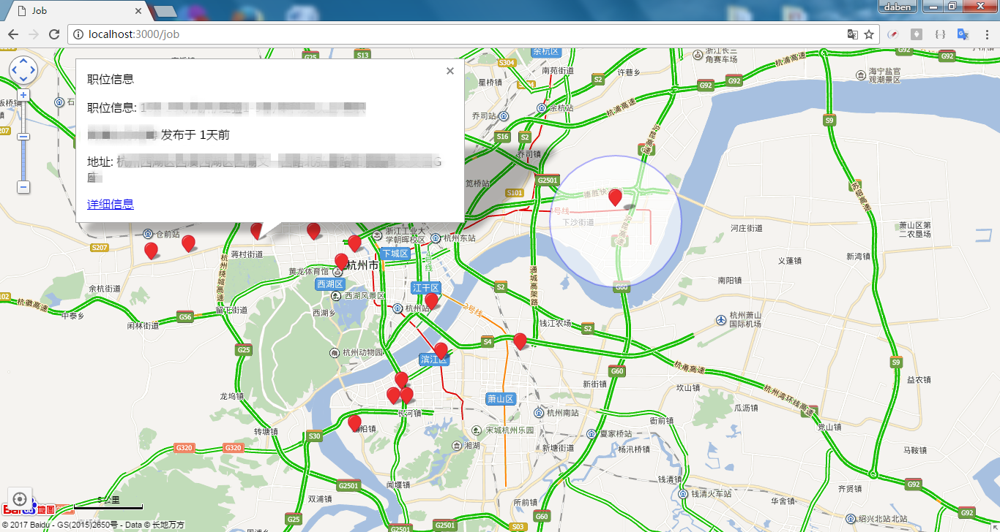
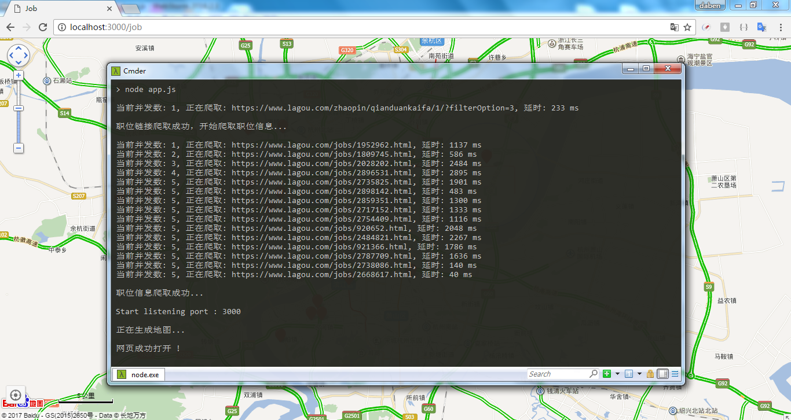

# job-crawler
对于不怎么爱认路的人来说，看到招聘单位的地址总是不能把它和具体地点对应到一块儿，于是写了个爬虫，把地址显示在百度地图上，这下再也不怕不知道在哪了。（灵感来源于去年看到的一个老哥，用爬虫爬租房信息，简直机智）
### 使用
```bash
$ npm install
$ npm start
```
爬的是拉钩的前端招聘页，爬取完之后显示在百度地图上。（顺便爬了一页试试，要爬多页的话去app.js改一下pageNum就好了）


欢迎交流，指正~
